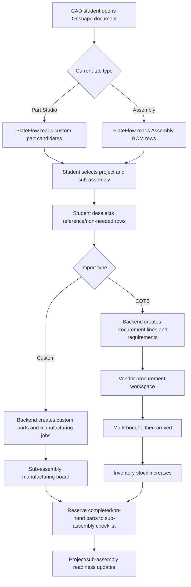
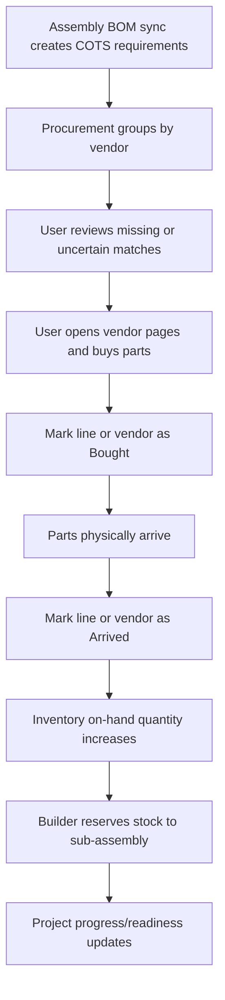
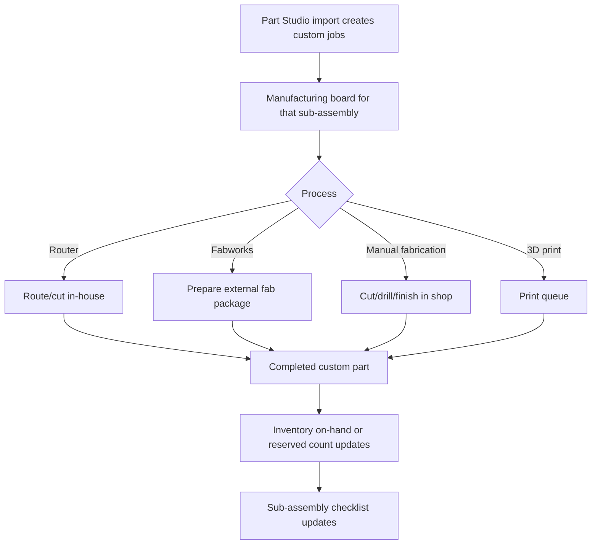

# PlateFlow Project Brief

PlateFlow is an FRC inventory and build-operations platform that connects Onshape CAD to team inventory, COTS procurement, custom part manufacturing, and project readiness tracking.

This document exists so a future Project chat or coding agent can continue the work without reading the entire original conversation.

## Product Goal

Build a fast, low-clutter operations tool for an FRC team. The app should help students and mentors answer:

- What parts does this robot or project need?
- Which custom parts need to be made?
- Which COTS parts need to be ordered?
- What has arrived?
- What is already on hand?
- What is reserved for a specific sub-assembly?
- Which sub-assemblies are ready?

The app should feel more like a small ERP/build-ops tool than a flashy dashboard.

## Surfaces

### Browser Dashboard

The main app used outside Onshape.

Primary sections:

- Overview
- Inventory
- Projects
- Procurement
- Settings
- Admin

Manufacturing is reached from project/sub-assembly context rather than being the main global workflow.

### Embedded Onshape App

A narrow right-panel app inside Onshape. It should stay focused on sync/import tasks.

Expected behavior:

- In Part Studio mode, import selected custom parts into manufacturing.
- In Assembly mode, import selected BOM/COTS rows into procurement.
- Let users choose the target project/sub-assembly.
- Give visible confirmation when imports succeed.
- Avoid side scrolling and large dashboard UI in the embedded panel.

### Shared Backend

The backend owns:

- Auth
- Sessions
- CSRF
- Onshape OAuth and API calls
- Inventory data
- Project requirements
- Procurement matching
- Manufacturing cards
- Settings
- Audit/admin data

The browser frontend should never call Onshape directly.

## Current Tech Stack

- Node.js ESM HTTP server: `server.mjs`
- Static frontend: `public/index.html`, `public/app.js`, `public/styles.css`
- Postgres via `pg` when `DATABASE_URL` exists
- File storage fallback for local/dev only
- Railway deployment
- Cloudflare DNS/custom domain
- Onshape OAuth app and Onshape embedded extension

There is no bundler/build step. Railway starts the app with:

```sh
node server.mjs
```

## Core Architecture Rule

Do not merge the two Onshape ingestion flows.

Keep these separate:

- Part Studio -> custom/manufacturing pipeline
- Assembly BOM -> COTS/procurement pipeline

They only meet after normalization in shared inventory, project requirements, and reservations.

## Roles

The app currently has only two roles:

- `admin`
- `student`

Admin can:

- Use the workspace
- View and edit Settings
- View and manage Admin/users
- Invite users
- Clear catalog/admin maintenance

Student can:

- Use inventory
- Use projects
- Use procurement
- Use manufacturing
- Import from Onshape
- Reserve/check off requirements

Student cannot:

- View Settings
- View Admin
- Manage users
- Change global configuration

Older roles such as mentor, purchaser, fabricator, and read_only should be treated as student if found in old data.

## Current Product Shape

### Overview

Shows high-level inventory/project state and selected project/sub-assembly progress.

Desired:

- More useful selected project summary.
- Show sub-assemblies with COTS ordered/reserved progress.
- Keep it operational, not decorative.

### Inventory

Global catalog of COTS and custom parts.

Important current behavior:

- One `Vendor/Machine` column:
  - COTS rows use vendor.
  - Custom rows use machine/process.
- Reserved is derived from project reservations and should not be directly editable.
- Needed hover should show which project/sub-assembly needs the part.
- Rows should be editable enough to correct imported data.
- Deleting and edits should feel fast/optimistic.

### Projects

Projects can be robots or standalone projects/assemblies.

Each project has sub-assemblies. A sub-assembly is generally based on the Onshape document/source being imported.

Desired project flow:

1. Create/select project.
2. Import Assembly BOM or Part Studio from Onshape to that project.
3. Dashboard creates/updates the sub-assembly.
4. Open that sub-assembly to view needed parts.
5. Reserve inventory as items are made/arrive.

### Manufacturing

Custom/manufacturing work is per sub-assembly.

Important behavior:

- Cards should be thin enough to scan.
- Drag/drop status changes should feel instant.
- Cards should show and allow editing process/machine.
- Custom parts can be moved from procurement when misclassified.
- Shafts may appear both as manufacturing cut tasks and as rolled-up stock procurement.

### Procurement

COTS ordering workspace grouped by vendor.

Supported/target vendors:

- REV
- The Thrifty Bot / TTB
- WCP
- AndyMark
- McMaster-Carr
- V-Belt Guys

Do not include CTRE as a vendor target unless the user asks later.

Important behavior:

- Cards/rows should stay compact and readable.
- Vendor view should be flat and easy to scan.
- Quantity edits must be accessible and obvious.
- Bought/Arrived should be fast and optimistic.
- "Arrived" should add stock to inventory.
- Entire vendor can be marked bought/arrived.
- Deleting should feel instant.

Vendor/link matching:

- WCP links often work by SKU URL, like `https://wcproducts.com/products/wcp-0252`.
- REV has similar predictable SKU/link behavior.
- McMaster packs must be treated carefully: if 18 fasteners are needed and the SKU is a pack of 50, order quantity should be 1 pack, not 18 packs.
- V-Belt Guys belt part numbers can be generated from tooth count/pitch/width.

### Settings

Admin-only global configuration.

Current/desired settings include:

- Part number format.
- Materials.
- Stock types.
- Machines/processes.
- Material-to-machine routing rules.
- Word/phrase auto-routing rules.

Settings should be intuitive, labeled, and have hover/help text. Avoid raw text-only config when a structured UI is possible.

## Onshape Integration Notes

Onshape API calls are expensive and rate-limited. Minimize them.

Important:

- Do not fetch previews repeatedly.
- Avoid individual part preview calls.
- Cache context/material/part data where possible.
- Prefer a single load and local edits inside the Onshape panel.
- Part Studio import should not require multiple reloads.
- Assembly BOM import should not hallucinate data. Use only BOM rows from the active assembly.

Embedded extension URL pattern:

```text
https://plateflow.org/onshape?embedded=1&documentId={$documentId}&workspaceOrVersion={$workspaceOrVersion}&workspaceOrVersionId={$workspaceOrVersionId}&elementId={$elementId}&configuration={$configuration}&server={$server}
```

OAuth:

- OAuth URL: `/auth/onshape`
- Callback URL: `/auth/onshape/callback`

## Part Numbering

Configured pattern example:

```text
4999-26-P-1001-DT
```

Meaning:

- `4999`: team/prefix
- `26`: season/year
- `P`: part
- `A`: assembly
- `1001`: block/sequence
- `DT`: subsystem acronym

Example:

- Drivetrain assembly: `4999-26-A-1000-DT`
- Drivetrain part: `4999-26-P-1001-DT`

Custom parts without a part number should receive generated part numbers. COTS parts without a SKU should not get fake custom part numbers.

## Current Deployment

Primary domain:

```text
https://plateflow.org
```

Railway is used for deployment. Required production settings include:

```text
APP_BASE_URL=https://plateflow.org
NODE_ENV=production
TRUST_PROXY=true
SESSION_SECRET=<secret>
DATABASE_URL=<Postgres URL>
ONSHAPE_CLIENT_ID=<secret>
ONSHAPE_CLIENT_SECRET=<secret>
ONSHAPE_API_BASE=https://cad.onshape.com
ONSHAPE_OAUTH_BASE=https://oauth.onshape.com
```

If `/api/session` says storage is file and not Postgres, fix `DATABASE_URL`. The app will not reliably persist shared data without Postgres.

## Public SaaS Roadmap

If PlateFlow becomes public for other FRC teams, the biggest required changes are:

1. Multi-tenancy with `team_id` on every team-owned record.
2. Team creation/join invite flow.
3. Strong per-team authorization checks on every API route.
4. Encrypted Onshape refresh tokens at rest.
5. Object storage for generated files/artifacts.
6. Background queue for expensive Onshape/vendor work.
7. Email/password reset/invites.
8. Privacy policy and terms.
9. Onshape App Store launch/review.

Do not publish broadly before true tenant isolation exists.

## Recent Fixes Before This Brief

Recent commits included:

- Faster optimistic project creation.
- Backward-compatible project create response.
- Dismissible notification bar.
- Optimistic project deletion.
- Simplified roles to admin/student.
- Inventory `Vendor/Machine` column.
- Shaft stock rollup fixes.
- Selected social embed card asset.

## Known Areas To Improve

- Continue optimizing project/sub-assembly delete and manufacturing card moves.
- Keep reducing Onshape API calls.
- Improve COTS/custom classification accuracy.
- Make procurement more reliable without hallucinated vendor matches.
- Improve pack quantity logic for McMaster and similar vendors.
- Make subsystem checklists the central workflow for builders/manufacturers.
- If public launch is desired, design multi-tenant data model before adding more features.

## Good Verification Checklist

Before pushing changes:

```sh
node --check server.mjs
node --check public/app.js
git diff --check
```

Manual test areas:

- Login as admin and student.
- Student cannot see Settings/Admin.
- Add/delete project feels instant.
- Inventory row edit persists.
- Onshape right panel does not side-scroll.
- COTS BOM import goes to procurement.
- Part Studio import goes to manufacturing.
- Procurement arrived increases inventory.
- Realtime updates do not reload the whole page.

## Detailed Repository Handoff

This section is intentionally detailed. It is meant for a future Project chat, coding agent, or student developer who has not read the original conversation.

### Repository Responsibilities

PlateFlow is currently a compact single-service web app:

- `server.mjs`
  - Owns all API routes.
  - Owns auth, sessions, CSRF, and role checks.
  - Owns storage selection and persistence.
  - Proxies all Onshape API calls.
  - Normalizes Part Studio and Assembly BOM imports.
  - Builds dashboard, inventory, project, procurement, and manufacturing snapshots.
  - Performs vendor matching and special procurement transformations.
  - Emits server-sent events for realtime UI updates.
- `public/app.js`
  - Owns browser UI state.
  - Renders both the full dashboard and the embedded Onshape panel.
  - Handles optimistic UI updates.
  - Calls only PlateFlow API routes, never Onshape directly.
  - Keeps dashboard navigation, filters, checklists, procurement, and manufacturing views in sync.
- `public/styles.css`
  - Owns all layout and visual styling.
  - Must handle the normal browser app and the narrow Onshape embedded panel.
  - Must avoid side scrolling and text overlap.
- `public/index.html`
  - Lightweight static shell.
- `docs/`
  - Deployment, Onshape setup, DNS, hosting, and product handoff docs.
- `AGENTS.md`
  - Fast checklist for coding agents.

There is no React, Next.js, Vite, Tailwind build, or server framework. That simplicity is intentional for now. Avoid introducing a build system unless the user explicitly chooses that direction, because the no-build setup keeps Railway deploys and debugging easy.

### Important Files

| File | Why It Matters |
| --- | --- |
| `server.mjs` | Main backend, API router, storage, Onshape integration, procurement logic. |
| `public/app.js` | Main frontend behavior for dashboard and Onshape panel. |
| `public/styles.css` | App layout, dark mode, embedded panel fixes, responsive/compact cards. |
| `public/plateflow-logo.png` | Current icon/logo. |
| `public/plateflow-embed-card.png` | Current social preview card asset. |
| `railway.json` | Railway deploy/start settings. |
| `.env.example` | Local env reference. |
| `.env.production.example` | Production env reference. |
| `docs/railway-deploy.md` | Railway setup details. |
| `docs/onshape-app-store-checklist.md` | Onshape extension/app setup details. |

## Detailed Product Model

### Product Surfaces

PlateFlow has two frontends backed by one shared backend.

#### Full Browser Dashboard

The browser dashboard is the main place where the team does operational work:

- View team/project state.
- Maintain global inventory.
- Track project and sub-assembly requirements.
- Manage COTS procurement.
- Manage custom part manufacturing.
- Configure settings.
- Administer users.

The dashboard should feel like an internal build-room tool. It should be dense, fast, and low clutter. It should not feel like a product landing page.

#### Embedded Onshape Panel

The Onshape app is not the dashboard. It is a narrow import/sync tool.

It should only do the CAD-side work:

- Detect the current Onshape document/workspace/element context from the extension URL.
- Let the user choose the target PlateFlow project/sub-assembly.
- In Part Studio context, load/select custom parts and submit them to manufacturing.
- In Assembly context, load/select BOM rows and submit COTS lines to procurement.
- Show clear import success/failure.
- Avoid full dashboard navigation.
- Avoid horizontal scrolling.
- Avoid repeated expensive Onshape calls.

#### Shared Backend

The backend is the trust boundary:

- Browser clients do not call Onshape.
- Browser clients do not receive Onshape refresh tokens.
- Mutating routes enforce app auth, role checks, and CSRF.
- All storage writes happen through server routes.
- Vendor matching and import normalization happen server-side.

### Primary Domain Objects

These are the product concepts used throughout the app. Exact internal storage fields may evolve, but these meanings should stay stable.

#### Team

Currently the app behaves as one team instance. If the product becomes public SaaS, every record below must be scoped by `team_id`.

#### User

Invite-only app user. Current app roles are only:

- `admin`
- `student`

#### Project

A top-level work target. It can be:

- A full-season robot.
- A practice/offseason project.
- A single standalone assembly.

The UI should use "Projects" broadly, not only "Robots", because the team sometimes tracks non-robot offseason work.

#### Sub-Assembly

A document/source-level grouping under a project.

Desired mental model:

- User selects a project.
- User imports an Onshape assembly or Part Studio.
- PlateFlow creates or updates a sub-assembly inside that project.
- Requirements, procurement lines, and manufacturing jobs can be shown per sub-assembly.

The sub-assembly name should generally come from the Onshape document/source name, not from a tiny internal tab label when possible.

#### Catalog Part

A normalized reusable part record.

For COTS:

- Vendor and vendor SKU are the strongest identity.
- Example: `WCP`, `WCP-0252`.

For custom:

- Generated team part number plus revision/source reference is the strongest identity.
- Example: `4999-26-P-1001-DT`.

#### Requirement

A project/sub-assembly needs a quantity of a catalog part.

Requirement quantities should not grow forever when the same BOM is imported multiple times. Re-imports should update or replace the relevant source requirement instead of blindly adding duplicate needs.

#### Reservation

Inventory committed to a project/sub-assembly requirement.

Reservations are the bridge between global stock and a specific build target.

#### Inventory Item

Global stock/catalog row visible in the Inventory page.

Important UI rule:

- The shared column should be `Vendor/Machine`.
- COTS rows show vendor.
- Custom rows show machine/process.
- Reserved quantity is derived and should not be manually edited.

#### Procurement Line

A line item to buy from a vendor.

Important:

- Procurement line quantity should represent the needed/orderable quantity clearly.
- Pack vendors like McMaster must distinguish "units needed" from "packs to order".

#### Manufacturing Job

A custom or shop-made item to fabricate, cut, route, print, or send out.

Manufacturing is per sub-assembly. The old global fabrication page should not be the main workflow.

#### File Artifact

Generated STEP files or future uploaded attachments.

Artifacts must be permission-scoped before any public SaaS release.

## Route Map

The backend uses literal route matching in `server.mjs`. If changing route names, update `public/app.js` at the same time.

### Auth And Session Routes

| Route | Method | Purpose |
| --- | --- | --- |
| `/api/session` | GET | Returns login state, CSRF token, app config state, storage status, and current user. |
| `/api/events` | GET | Server-sent events stream for lightweight realtime dashboard updates. |
| `/auth/plateflow/register` | POST | Creates the first admin during bootstrap or registers an invited user. |
| `/auth/plateflow/login` | POST | Email/password PlateFlow login. |
| `/auth/plateflow/logout` | any | Logs out of PlateFlow app account. |
| `/auth/onshape` | GET | Starts Onshape OAuth. |
| `/auth/onshape/callback` | GET | Handles OAuth callback and stores Onshape token data in the server-side session/store. |
| `/auth/logout` | any | Legacy/combined logout path. |

### Dashboard And Inventory Routes

| Route | Method | Purpose |
| --- | --- | --- |
| `/api/dashboard` | GET | Main snapshot for overview, procurement, manufacturing, projects, and shared nav counts. |
| `/api/inventory` | GET | Inventory snapshot. |
| `/api/inventory/items` | POST | Create manual inventory item. |
| `/api/inventory/items/bulk-delete` | POST | Bulk delete selected inventory items. |
| `/api/inventory/items/:itemKey` | PATCH | Update an inventory item. |
| `/api/inventory/items/:itemKey` | DELETE | Delete an inventory item. |

### Project Routes

| Route | Method | Purpose |
| --- | --- | --- |
| `/api/robots` | GET | Returns projects/robots and sources. The old route name still says robots. |
| `/api/robots` | POST | Create a project or robot. |
| `/api/robots/:robotId` | DELETE | Delete a project/robot. |
| `/api/robots/:robotId/requirements` | POST | Attach requirements from a synced BOM/source. |
| `/api/robots/:robotId/requirements/:requirementId` | PATCH | Update requirement/reservation state. |
| `/api/robots/:robotId/subassemblies/:subassemblyId` | DELETE | Remove a sub-assembly from a project. |

### Manufacturing Routes

| Route | Method | Purpose |
| --- | --- | --- |
| `/api/fabrication/jobs/:jobId` | PATCH | Update manufacturing/fabrication job status, process, notes, or metadata. |
| `/api/fabrication/jobs/:jobId` | DELETE | Delete manufacturing/fabrication job. |

The route names still say fabrication in places, but the user-facing wording should be Manufacturing.

### Procurement Routes

| Route | Method | Purpose |
| --- | --- | --- |
| `/api/procurement/refresh` | POST | Refresh vendor matching for current procurement lines. |
| `/api/procurement/lines` | POST | Manually add a procurement line. |
| `/api/procurement/lines` | PATCH | Bulk/update procurement lines, quantities, vendor data, statuses. |
| `/api/procurement/lines` | DELETE | Delete one or many procurement lines. |
| `/api/procurement/lines/transfer-manufacturing` | POST | Move misclassified custom lines into manufacturing. |
| `/api/procurement/orders/:orderId` | PATCH | Update procurement order status. |

### Onshape Routes

| Route | Method | Purpose |
| --- | --- | --- |
| `/api/onshape/import` | POST | Part Studio import into custom/manufacturing. |
| `/api/onshape/import-cots` | POST | Assembly BOM import into COTS/procurement. |
| `/api/onshape/export-step` | POST | Export selected custom part STEP data. |
| `/api/downloads/:id` | GET | Download generated file/blob artifact. |

### Settings And Admin Routes

| Route | Method | Purpose |
| --- | --- | --- |
| `/api/settings` | PATCH | Update admin-only global settings. |
| `/api/admin/users` | GET | Admin user list. |
| `/api/admin/users/:id` | PATCH | Edit user details/role. |
| `/api/admin/users/:id` | DELETE | Delete/deactivate user. |
| `/api/admin/invites` | POST | Create invite. |
| `/api/admin/clear-catalog` | POST | Clear catalog/admin maintenance. |
| `/api/admin/remove-placeholder-cots` | POST | Remove placeholder COTS rows. |
| `/api/audit-log` | GET | Admin audit log snapshot. |

## Frontend State And Rendering Details

### Dashboard Flow

Typical dashboard lifecycle:

1. `init()` loads `/api/session`.
2. If unauthenticated and bootstrap is required, render first-admin setup.
3. If unauthenticated and bootstrap is complete, render the plain PlateFlow login card.
4. If authenticated, render dashboard chrome and load `/api/dashboard`.
5. Navigation changes only re-render the active dashboard page from the existing snapshot when possible.
6. SSE or fallback refresh updates data without a full page reload.

The user strongly dislikes seeing the login card flash for a moment after clicking the logo or refreshing while already signed in. Keep the authenticated path smooth.

### Embedded Onshape Flow

The Onshape panel should detect embedded mode through URL parameters such as:

```text
embedded=1
documentId=...
workspaceOrVersionId=...
elementId=...
server=https://cad.onshape.com
```

The embedded panel should:

- Render only the import tool.
- Show Onshape connection state.
- Avoid dashboard tabs.
- Avoid full-page scroll weirdness.
- Keep checkboxes and part names from overlapping.
- Keep actions accessible in a narrow side panel.

### Optimistic UI Pattern

For actions that are expected to succeed:

1. Update local state immediately.
2. Re-render the affected area only.
3. Send API request.
4. If success, reconcile with returned server snapshot if needed.
5. If failure, restore previous local state and show dismissible error.

Use this for:

- Project add/delete.
- Sub-assembly delete.
- Procurement quantity changes.
- Procurement delete.
- Bought/arrived status changes.
- Vendor bulk bought/arrived.
- Manufacturing card status drag/drop.
- Reservation changes.

Avoid optimistic behavior only when an action is destructive and cannot be safely reverted in local state.

### Notification Behavior

Desired behavior:

- Success notifications fade out after about 2 seconds.
- Errors stay visible until dismissed.
- Every notification/error bar should have a small close button.
- Login should not show old import-success notifications.

## Detailed Workflows

### First Admin Setup

Expected production setup:

1. Deploy app with Postgres configured.
2. Visit app domain.
3. `/api/session` returns `bootstrapRequired: true` only if no users exist in the active persistent store.
4. Create first admin.
5. Invite students.

If first-admin setup appears after accounts already existed, likely causes are:

- `DATABASE_URL` is missing.
- `DATABASE_URL` points at a wrong database.
- Railway internal database hostname is unreachable from current environment.
- The app fell back to file storage.

The `/api/session` response is the best first diagnostic. If it reports `storage.kind: "file"` in production, fix storage before debugging auth or missing data.

### CAD Designer Part Studio Workflow

Goal: send custom fabricated parts from Onshape into the correct sub-assembly manufacturing board.

1. CAD student opens the relevant Part Studio in Onshape.
2. PlateFlow right panel opens in embedded mode.
3. Student connects Onshape if needed.
4. Student selects target project.
5. Student selects or confirms target sub-assembly.
6. Student loads Part Studio custom parts.
7. App reads part names, material, thickness/stock where possible.
8. App applies settings rules:
   - Material routing.
   - Stock routing.
   - Machine/process routing.
   - Word/phrase auto rules.
9. Student deselects reference geometry or anything that should not be imported.
10. Student imports selected parts.
11. Backend creates or updates custom catalog parts, requirements, and manufacturing jobs.
12. Dashboard updates without needing manual refresh.

Important:

- Do not call vendor matching for these rows.
- Do not put these rows into normal procurement.
- If a custom part has no part number, generate one using the configured part number scheme.
- COTS parts without SKU should not receive fake custom part numbers.

### CAD Designer Assembly BOM Workflow

Goal: send purchased/COTS rows from Assembly BOM into procurement for a specific project/sub-assembly.

1. CAD student opens the relevant Assembly in Onshape.
2. PlateFlow right panel opens in embedded mode.
3. Student selects target project.
4. Student selects or confirms target sub-assembly.
5. Student clicks Assembly BOM Sync.
6. App loads BOM rows from the active assembly.
7. Student deselects reference rows or parts that should not be imported.
8. Backend classifies rows:
   - Clear COTS rows go to procurement.
   - Custom rows should be blocked from procurement or moved to manufacturing.
   - Shaft cut rows may become manufacturing cut tasks and also contribute to a rolled-up shaft stock procurement line.
9. Backend deduplicates against previous imports from the same source.
10. Dashboard updates procurement and project requirement views.

Important:

- Assembly BOM sync must use only real active assembly BOM rows.
- Do not generate demo/fake rows.
- Imports should be idempotent enough that retrying does not duplicate counts.

### Procurement Workflow

Goal: turn COTS needs into vendor-specific order work and update inventory when items arrive.

1. User opens Procurement.
2. User selects the relevant project.
3. If the project is a robot, user can narrow to a sub-assembly.
4. User reviews vendor groups.
5. User fixes any `Needs review` line manually.
6. User opens vendor links and purchases items.
7. User marks individual line or entire vendor as Bought.
8. When items physically arrive, user marks individual line or entire vendor as Arrived.
9. Arrived lines add stock into Inventory.
10. Project/sub-assembly requirement and reservation views update.

Important:

- Bought means ordered/paid.
- Arrived means physical stock is available and should increment inventory.
- A line can be editable because vendor data may be wrong.
- Delete should be instant from the UI perspective.
- Cards should be compact and flat; avoid deep stacking.

### Manufacturing Workflow

Goal: track custom shop work per sub-assembly.

1. User opens a project.
2. User opens a sub-assembly.
3. User opens that sub-assembly manufacturing board.
4. Cards are grouped by manufacturing status.
5. User drags cards between columns.
6. Status changes immediately in the UI.
7. User can change process/machine if missing or wrong.
8. When a custom part is complete or received, inventory/requirements can be updated through the checklist/reservation flow.

Manufacturing cards should show:

- Part name.
- Quantity.
- Part number if available.
- Machine/process.
- Material/stock only if useful.
- Notes if present.

Manufacturing cards should not be tall, verbose cards that require endless scrolling.

### Builder/Manufacturer Checklist Workflow

Goal: each sub-assembly has a simple checkoff/inventory list.

Preferred user mental model:

- Needed: how many this sub-assembly requires.
- On hand: how many exist in global inventory.
- Reserved: how many are committed to this sub-assembly.

Do not over-emphasize installed, arrived, or ordered in this checklist. The user specifically wanted the simpler model:

- Needed
- On hand
- Reserved

The checklist should let students slowly reserve parts as they manufacture them or as COTS parts arrive.

## CAD To Shop Workflow Diagram



## Procurement To Inventory Workflow Diagram



## Manufacturing Workflow Diagram



## COTS Versus Custom Classification

This is one of the most important product rules.

### COTS

COTS means purchased as a ready-made item.

Examples:

- Motors.
- Bearings.
- Belts.
- Pulleys bought as vendor products.
- Gears bought as vendor products.
- Electronics.
- Hardware.
- Vendor assemblies.
- McMaster fasteners.
- REV/WCP/TTB/AndyMark catalog items.

COTS belongs in Procurement and Inventory.

### Custom

Custom means made, cut, routed, printed, machined, or sent out.

Examples:

- Plates.
- Gussets.
- Custom tubes.
- Custom brackets.
- Spacers made from stock.
- Shaft cut tasks.
- 3D printed parts.
- Custom HTD5 pulley if modeled as a custom part.

Custom belongs in Manufacturing and Inventory.

### Special Shaft Rule

Shafts are both:

- A purchased stock item.
- A custom cut task.

Desired behavior:

1. Assembly BOM imports individual shaft cut needs as manufacturing tasks for the sub-assembly.
2. Procurement does not show every shaft cut length as a separate order line.
3. Procurement rolls all shaft cut lengths into stock lengths to buy.
4. Current desired default stock:
   - Vendor: `WCP`
   - SKU: `WCP-2144`
   - Name: `1/2" Rounded Hex Shaft`
   - Stock length: `36 in`
5. Total shaft inches = sum of all detected cut lengths times BOM quantity.
6. Order quantity = `ceil(total shaft inches / 36)`.
7. Extra stock is acceptable.

Examples:

- One 11 inch shaft and one 24 inch shaft = 35 inches total = one 36 inch stock length.
- Eight 7.05 inch shafts = 56.4 inches total = two 36 inch stock lengths.

Shaft names that should parse:

- `1/2" Rounded Hex Shaft 11 in`
- `11 in. Rounded Hex Shaft`
- `1/2" Rounded Hex (REV) (7.05 in)`
- `1/2" Rounded Hex (23.1" L, 13.75mm OD)`

Non-shaft words like `shaft collar` must not be treated as shaft stock.

## Vendor Matching Detail

Vendor matching should prefer deterministic SKU links before fuzzy search.

### Allowed Vendor Targets

Use these vendors unless the user asks to add more:

- REV
- The Thrifty Bot / TTB
- WCP
- AndyMark
- McMaster-Carr
- V-Belt Guys

Do not include CTRE as a target in the procurement vendor list unless requested.

### Matching Confidence

Suggested statuses:

- Exact SKU: reliable direct SKU match.
- SKU match: likely direct SKU match.
- Vendor match: vendor/name match but not guaranteed.
- Needs review: user must inspect or fill in data.

### WCP

Many WCP links can be generated directly from SKU:

```text
https://wcproducts.com/products/wcp-0252
```

The slug is the lowercase SKU. Prefer direct link generation over broad vendor search when a WCP SKU exists.

### REV

REV should also prefer direct SKU/link patterns when reliable. If the exact product URL is not known, still keep the SKU visible and mark the line as needing review rather than inventing a price.

### The Thrifty Bot

TTB rows often have product variants. Be careful with variant/configuration text.

### AndyMark

AndyMark SKUs may use `am-` casing. Normalize enough for matching, but preserve the displayed SKU the user expects.

### McMaster-Carr

McMaster is special because many items are packs.

Rules:

- Keep vendor as `McMaster-Carr`.
- Keep SKU as the McMaster part number.
- If product metadata says `Pack of 50`, do not treat the BOM needed quantity as 50-packs.
- If 18 fasteners are needed from a pack of 50, the order quantity is 1 pack.
- If 120 fasteners are needed from a pack of 50, the order quantity is 3 packs.
- UI should show both the practical needed count and pack/order context clearly.

### V-Belt Guys

V-Belt Guys should support belt SKU generation from pitch, teeth, and width.

User-provided rule:

- `55T 5M 9MM wide` means pitch `5M`, teeth `55`, width `9mm`.
- First numeric section is pitch mm times tooth count: `5 * 55 = 275`.
- Width is padded to two digits when needed.
- Example generated SKU format: `275-5M-09`.
- A 15mm wide belt would end in `15`.

Do not overfit to one exact capitalization. Parse common forms such as:

- `55T 5M 9MM`
- `55T 5M 9mm wide`
- `55 tooth HTD 5M 15mm`

## Settings Detail

Settings should be structured, understandable, and admin-only.

### Part Number Settings

Purpose:

- Generate custom part numbers when custom parts lack one.
- Keep assembly and part numbering consistent.

Desired pattern:

```text
4999-26-P-1001-DT
```

Where:

- `4999`: team prefix.
- `26`: season/year.
- `P`: individual custom part.
- `A`: assembly.
- `1001`: sequence number.
- `DT`: subsystem acronym.

Subsystem acronyms requested:

- Drivetrain: `DT`
- Shooter: `ST`
- Intake: `IT`
- Indexer: `IN`
- Climber: `CR`
- Bumpers: `BR`

Assembly examples:

- Drivetrain assembly: `4999-26-A-1000-DT`
- First drivetrain custom part: `4999-26-P-1001-DT`

### Material Settings

Purpose:

- Define supported materials.
- Attach default machines/processes to materials.

Examples:

- Polycarbonate Clear -> Router.
- Polycarbonate Smoked -> Router.
- Aluminum -> Fabworks.

### Stock Settings

Purpose:

- Define stock forms that custom parts can use.

Examples:

- Tube 1x1.
- Tube 1x2.
- Tube 2x2.
- Spacer stock.
- Churro.
- Rounded hex.
- Sheet.
- Plate.

### Machine/Process Settings

Purpose:

- Define where/how custom parts get made.

Examples:

- Router.
- Fabworks.
- Manual fabrication.
- 3D print.
- In-house CNC.

User-facing wording should prefer `Manufacturing` over `Fabrication` for the page/board. Internal data may still use old fabrication naming.

### Material-To-Machine Routing

Purpose:

- Automatically choose process/machine from material.

Example:

- If material contains `polycarbonate`, route to `Router`.
- If material contains `aluminum` or `aluminium`, route to `Fabworks`.

### Word/Phrase Auto-Routing

Purpose:

- Automatically classify special names.

Examples:

- If part name contains `ROUND Spacer`, set process to spacer/manual fabrication.
- If part name contains `shaft` and parseable length, treat as shaft cut logic.
- If part name contains `Custom HTD5 5mm Pulley`, classify as custom/manufacturing.

Settings UI should not be vague. Each setting group should have:

- Clear label.
- Short help text.
- Example.
- Tooltip or hover explanation.
- Add/remove row controls.
- Validation when the config is malformed.

## API Budget And Onshape Performance

Onshape API allocation is limited and the user has already received API allocation warnings. Treat this as a product constraint.

### High-Level Rule

Do not spend Onshape API calls unless the user explicitly loads/imports from Onshape.

### Current Optimization Direction

- Remove or avoid individual part preview API calls.
- Cache document metadata.
- Cache Part Studio part lists.
- Cache Assembly BOM responses.
- Reuse already loaded panel state for selection/import.
- Avoid polling Onshape from the browser dashboard.
- Use PlateFlow storage snapshots for dashboard data.

### Expected API Call Shape

The ideal target for common actions:

- Open dashboard: 0 Onshape API calls.
- Browse inventory/projects/procurement: 0 Onshape API calls.
- Open embedded panel with existing loaded state: 0 to 1 Onshape API call.
- Load Assembly BOM: 1 Onshape BOM call, plus maybe 1 document metadata call if not cached.
- Load Part Studio: as few calls as possible, ideally one parts call and only additional metadata calls when absolutely necessary.
- Import selected already-loaded rows: 0 additional Onshape API calls unless export/metadata is required.
- Export STEP: Onshape calls are expected, but should happen only on explicit user action.

### Things To Avoid

- One API call per row for previews.
- Re-fetching the same BOM every render.
- Re-fetching document name every import if already cached.
- Loading Part Studio just to decide COTS/custom for dashboard procurement.
- Dashboard refreshes that call Onshape.

## Persistence And Storage

### Production Rule

Production must use Postgres.

If `/api/session` reports:

```json
{
  "storage": {
    "kind": "file",
    "persistent": false
  }
}
```

then production data is not reliably shared/persistent.

### Common Railway Database Issue

If `/api/session` reports:

```text
getaddrinfo ENOTFOUND postgres.railway.internal
```

then the app cannot resolve the internal Railway database hostname from where it is running. Use the correct Railway-connected database URL for that service/environment.

### What Must Persist

- Users.
- Sessions/token references.
- Settings.
- Projects.
- Sub-assemblies.
- Catalog parts.
- Inventory counts.
- Requirements.
- Reservations.
- Procurement lines/statuses.
- Manufacturing jobs/statuses.
- Audit logs.

## Security Requirements

### Current Security Expectations

- Invite-only accounts.
- Admin bootstrap only when no users exist.
- Session cookies.
- CSRF for mutating routes.
- Server-side role checks.
- Onshape OAuth server-side.
- No Onshape direct browser API calls.
- No committed secrets.
- Settings/Admin hidden from students and enforced server-side.

### Public Release Security Requirements

Before public multi-team use:

- Add true `team_id` tenancy to all records.
- Enforce tenant checks on every read/write route.
- Encrypt Onshape refresh tokens at rest.
- Add password reset or passwordless email.
- Add email verification or invite verification.
- Add rate limiting per route/IP/user/team.
- Add audit logs for user/admin/inventory/procurement changes.
- Add object storage permission checks.
- Add privacy policy and terms.

## Deployment Detail

### Railway Required Variables

```text
APP_BASE_URL=https://plateflow.org
NODE_ENV=production
TRUST_PROXY=true
SESSION_SECRET=<long random secret>
DATABASE_URL=<Postgres URL>
ONSHAPE_CLIENT_ID=<Onshape OAuth client id>
ONSHAPE_CLIENT_SECRET=<Onshape OAuth secret>
ONSHAPE_API_BASE=https://cad.onshape.com
ONSHAPE_OAUTH_BASE=https://oauth.onshape.com
```

### Optional Vendor Variables

Add these only if implemented/configured:

```text
FRC_TOOLS_SEARCH_URL=<vendor search endpoint>
MCMASTER_API_BASE=<if official/integrated source exists>
MCMASTER_CERT=<if required by official integration>
MCMASTER_KEY=<if required by official integration>
```

Do not invent McMaster API credentials. The user must obtain vendor credentials from the vendor or supported integration source.

### Onshape OAuth App Fields

For the production app:

```text
Name: plateflow
Primary format: org.plateflow
Type: Integrated Cloud App
OAuth URL: https://plateflow.org/auth/onshape
Redirect URL: https://plateflow.org/auth/onshape/callback
```

For a test classroom app:

- Create a new OAuth app in the test classroom.
- Use the same domain/URLs unless testing a separate deployment.
- Copy the new client ID and secret into Railway env vars.
- Existing refresh tokens from the old client will not work with the new client ID.
- Users must reconnect Onshape after changing client ID/secret.

If Onshape says `Refresh token and client ID don't match`, the app is using a refresh token issued to a different OAuth app. Disconnect/reconnect Onshape or clear the old token/session.

## UI And UX Principles

### Overall Feel

The app should feel:

- Fast.
- Clear.
- Operational.
- Student-friendly.
- Dense enough for real work.
- Not decorative for its own sake.

### Visual Style

Current direction:

- Lowercase `plateflow` branding.
- Standard system font stack, not custom web fonts.
- Dark mode with blue accents.
- Light mode with clean cards.
- Dot grid background may be used when it does not reduce readability.
- Use the provided logo asset.

### Layout Rules

- Avoid horizontal scrolling.
- Avoid text overlapping controls.
- Keep procurement cards compact.
- Keep manufacturing cards thin and scannable.
- Keep tables wide enough that primary columns are readable.
- In the Onshape panel, favor single-column stacked controls.
- Do not put the full dashboard in the Onshape panel.

### Accessibility Expectations

- Buttons must have readable labels.
- Controls must be keyboard reachable where practical.
- Color should not be the only status indicator.
- Hover effects should improve row tracking without making the UI busy.
- Large clickable targets for student use in a shop environment.
- Error messages should be dismissible.

## Known Bugs And Watchpoints

These have come up repeatedly and should be checked after related changes.

### Onshape Panel Text Overlap

Symptom:

- Part names overlap checkboxes in the narrow Onshape panel.

Likely fix area:

- `public/styles.css`, embedded panel table/list layout.
- Ensure checkbox column has fixed width.
- Ensure part text starts after the checkbox column.
- Allow part names to wrap without covering controls.

### Procurement Delete Feels Slow

Symptom:

- Delete waits for the server before removing the line visually.

Preferred fix:

- Optimistically remove locally.
- Reconcile on success.
- Restore on failure.

### Project Counts Too High

Symptom:

- Project/sub-assembly says hundreds of needed parts when actual BOM is much smaller.

Likely causes:

- Duplicate imports not replacing existing source requirements.
- Pack quantities treated as raw needed quantities.
- Shaft rollup quantity math multiplying by pack/order length.
- Counting total units instead of unique lines where UI should show lines.

### Custom Parts In Procurement

Symptom:

- Plates, custom pulleys, shafts, or custom tubes appear as procurement lines.

Likely causes:

- Assembly BOM has custom-modeled parts that look like purchasable items.
- Classification rules are too loose.
- Existing stale procurement lines remain from older imports.

Preferred behavior:

- New imports should classify obvious custom parts into manufacturing.
- Existing bad lines can be moved with `Move to manufacturing`, but that button should be shown mainly for lines without a real SKU/part number or lines flagged as likely custom.

### First Admin Prompt Appears Again

Symptom:

- App asks to create first admin even though admin existed.

Likely cause:

- App is using file storage or wrong Postgres database.

First check:

- `/api/session`.

### Onshape OAuth Client Mismatch

Symptom:

```json
{"error":"invalid_client","error_description":"Refresh token and client ID don't match"}
```

Likely cause:

- Railway env vars changed to a new OAuth client ID/secret while old refresh token remains.

Fix:

- Disconnect/reconnect Onshape.
- Clear old session/token data if needed.

## Acceptance Criteria For The Current Internal MVP

The internal team MVP should be considered healthy when:

- Admin can invite/manage users.
- Student can do normal work but cannot see Settings/Admin.
- Browser dashboard loads directly for signed-in users without login flicker.
- Onshape panel only shows import/sync controls.
- Part Studio import creates manufacturing/custom items.
- Assembly BOM import creates COTS/procurement items.
- Custom parts are not normal procurement lines.
- Procurement can be filtered by project/sub-assembly/vendor.
- Procurement quantities/statuses/delete feel instant.
- Arrived procurement lines add stock to inventory.
- Inventory shows reserved counts as derived read-only values.
- Sub-assembly checklist shows needed, on hand, reserved.
- Manufacturing board is per sub-assembly.
- Manufacturing card drag/drop feels instant.
- Settings are understandable and admin-only.
- Onshape API usage stays low.
- Postgres is active in production.

## Public SaaS Expansion Plan

If the app is made available to other FRC teams, do not simply point multiple teams at this instance.

### Phase A: Tenant Foundation

- Add `teams` table/model.
- Add `team_id` to every team-owned record.
- Scope every query by current user team.
- Add team membership and invitations.
- Migrate current single-team data into one team.

### Phase B: Auth Hardening

- Add email verification or invite token verification.
- Add password reset or passwordless login.
- Add optional SSO later.
- Add rate limiting.
- Add account recovery/admin recovery plan.

### Phase C: Onshape Multi-Team Integration

- Store Onshape OAuth tokens per team/user as appropriate.
- Encrypt refresh tokens.
- Allow each team to configure its own Onshape OAuth app or use a centrally reviewed app if permitted.
- Add diagnostics for API usage per team.

### Phase D: Storage And Jobs

- Move STEP/generated artifacts to S3/R2-compatible object storage.
- Add background queue for STEP exports, vendor matching, and heavy sync.
- Add retry and partial failure reporting.

### Phase E: Product/Legal

- Privacy policy.
- Terms.
- Onshape App Store review materials.
- Support/contact channel.
- Team deletion/export process.

## Decision Log

These decisions came from the original build conversation:

- Use Railway instead of Render because Render free sleep was too slow and paid Render felt expensive for this app.
- Keep the app internal-first, not a marketing site.
- Use lower-case `plateflow`.
- Use system fonts so the app looks consistent without font loading concerns.
- Use only `admin` and `student` roles.
- Students can do nearly all build work; only Settings/Admin are admin-only.
- Remove global Raw section from primary nav.
- Rename Targets to Projects.
- Manufacturing belongs under sub-assemblies, not as the main global page.
- Procurement should be vendor-grouped and project/sub-assembly filterable.
- COTS and custom ingestion must stay separate.
- Avoid part previews because they cost too many Onshape API calls.
- Use deterministic vendor SKU links before broad/fuzzy search.
- Do not include CTRE as a procurement vendor target by default.

## Future Task Backlog

### Near-Term High Value

- Fix any remaining Onshape panel layout overlap.
- Make procurement delete fully optimistic.
- Make manufacturing drag/drop resilient under rapid moves.
- Finish pack/order quantity display for McMaster.
- Harden shaft rollup and prevent shaft collars from matching shaft stock logic.
- Ensure duplicate BOM imports update existing source requirements.
- Improve custom-vs-COTS classification with clear admin-configurable rules.
- Make settings UI more form/template-based and less raw-text based.

### Medium-Term

- Add import revision/diff view.
- Add "clear old import for this sub-assembly" action.
- Add saved procurement filters.
- Add better audit log filtering.
- Add admin data export.
- Add QR/bin labels.
- Add file artifacts for STEP/quotes.
- Add Fabworks quote preparation workflow.

### Long-Term

- Multi-team public SaaS.
- Background job queue.
- Vendor API integrations where official APIs exist.
- AI-assisted procurement matching with human approval.
- Shop-floor mobile/scanner workflows.

## AI Procurement Concept

AI can be useful later, but it should not be allowed to silently make purchases or invent matches.

Best use:

- Suggest likely vendor matches from name/SKU/context.
- Explain why a match is uncertain.
- Normalize messy BOM names.
- Flag likely custom parts that accidentally entered procurement.
- Suggest pack/order quantities.
- Suggest missing metadata.

Required guardrails:

- AI output must be marked as suggestion/review.
- User approves before saving a vendor link/price when confidence is low.
- Never fabricate a price.
- Prefer deterministic vendor data over AI.
- Store the source of each suggestion.

## Manual Test Script

Use this after bigger changes:

1. Open app while logged out.
2. Confirm plain `plateflow` login screen appears.
3. Log in as admin.
4. Confirm no login flash when clicking logo or refreshing.
5. Confirm Settings and Admin appear.
6. Log in as student.
7. Confirm Settings and Admin are hidden.
8. Create a project.
9. Delete that project.
10. Confirm both feel instant.
11. Import or simulate COTS lines.
12. Confirm procurement appears under correct project/sub-assembly.
13. Change quantity.
14. Mark Bought.
15. Mark Arrived.
16. Confirm inventory increments.
17. Delete procurement line.
18. Confirm it disappears immediately.
19. Import or simulate custom part.
20. Confirm it appears in manufacturing, not procurement.
21. Drag manufacturing card between statuses.
22. Confirm it moves immediately and stays there.
23. Open inventory.
24. Confirm Vendor/Machine column shows vendor for COTS and process/machine for custom.
25. Confirm Reserved is read-only/derived.
26. Open embedded Onshape URL or real Onshape panel.
27. Confirm it does not show dashboard nav.
28. Confirm part names do not overlap checkboxes.
29. Confirm import success is visible but not noisy.
30. Open `/api/session`.
31. Confirm `storage.kind` is Postgres in production.

## Agent Guidance For Future Work

When the user says something feels slow, treat it as a real usability bug. This app is used by multiple students in live shop/CAD workflows, so perceived latency matters.

Default implementation style:

- Read existing patterns first.
- Make small, targeted patches.
- Keep optimistic state updates where appropriate.
- Avoid broad refactors unless they clearly reduce ongoing pain.
- Verify with syntax checks.
- Commit and push if the user asked for implementation.

When unsure about product meaning, preserve these anchors:

- COTS means buy.
- Custom means make.
- Inventory is global.
- Requirements are per project/sub-assembly.
- Reservations connect global stock to a specific need.
- Onshape panel imports.
- Dashboard operates.
